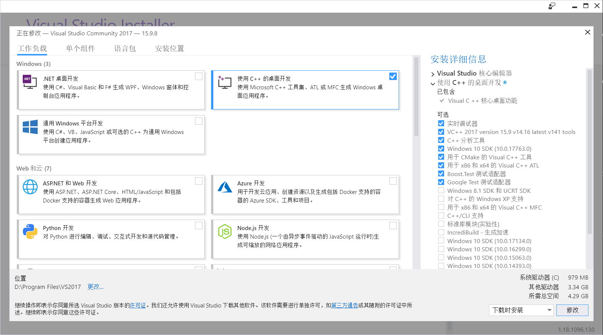
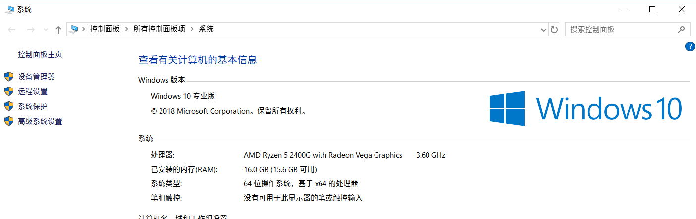
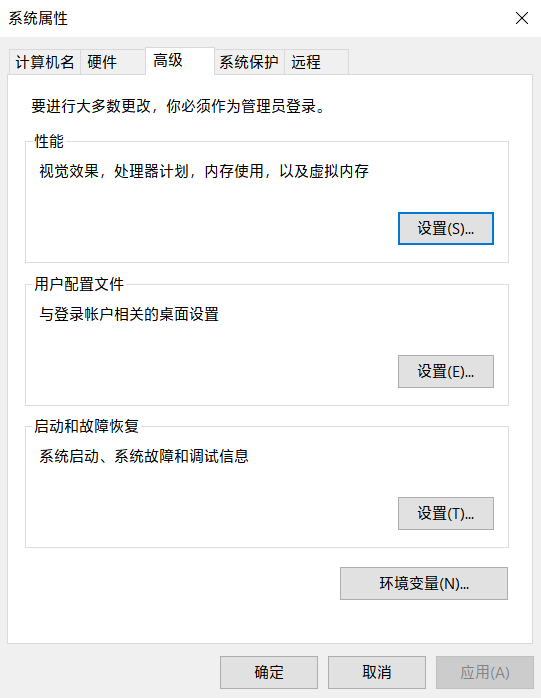
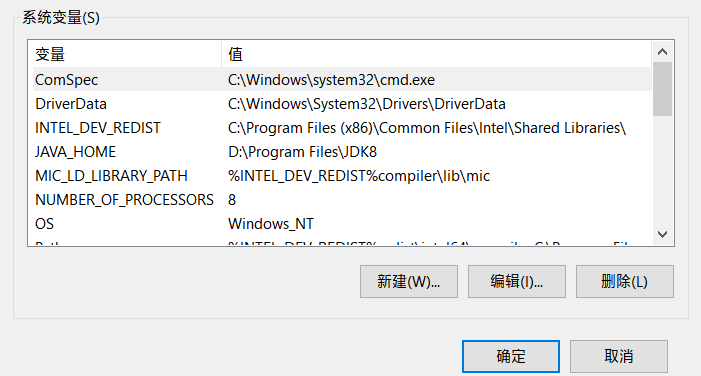
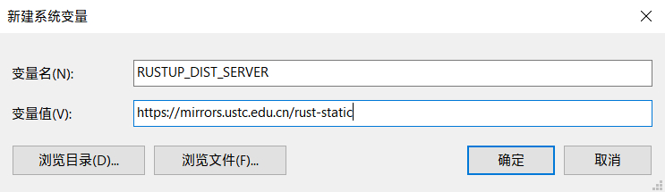

# 将Rust安装到你的电脑上
## rustup
`rustup` 是一个管理 Rust 版本和相关工具的命令行工具，官方推荐使用它来完成Rust的安装。

安装过程中需要网络连接，而且由于某些原因，你需要进行一些设置使其连接国内镜像服务器以加速下载。

## Linux 和 macOS
### 设置中科大镜像源
打开终端并输入如下命令：

`RUSTUP_DIST_SERVER` (用于下载和更新 toolchain )
```
export RUSTUP_DIST_SERVER=https://mirrors.ustc.edu.cn/rust-static
```
`RUSTUP_UPDATE_ROOT` (用于更新 rustup )
```
export RUSTUP_UPDATE_ROOT=https://mirrors.ustc.edu.cn/rust-static/rustup
```
### 安装 rustup 和 Rust

打开终端并输入如下命令：
```shell
curl https://sh.rustup.rs -sSf | sh
```
这个命令下载一个脚本并开始安装 `rustup`，此后 `rustup` 会提示你完成Rust的后续安装操作。
## Windows
### 安装 Visual C++ 生成工具
你需要安装一个 `Visual Studio` 来完成 Visual C++ 生成工具的安装。这里以Visual Studio 2017为例。

在[此处](https://visualstudio.microsoft.com/zh-hans/thank-you-downloading-visual-studio/?sku=Community&rel=15)下载 `Visual Studio Installer`，它是一个帮助你安装 `Visual Studio` 的工具。

打开 `Visual Studio Installer` ，选择安装 `Visual Studio Community` 版本，它对于个人用户是免费的。



如图所示，勾选 `使用C++的桌面开发` 。点击 `安装` 即可。

>注意：Visual Studio 将占用大量磁盘空间。
如果你不想将其安装到C盘，请点击 `安装位置` 以自行设置。

### 设置中科大镜像源
如图所示，点击 `高级系统设置`。



点击 `环境变量`。



在系统变量处，选择 `新建` 。



在 `变量名` 处和 `变量值` 处分别填入 `RUSTUP_DIST_SERVER` 和 `https://mirrors.ustc.edu.cn/rust-static` ，点击确定。



继续点击 `新建` ，在 `变量名` 处和 `变量值` 处分别填入 `RUSTUP_UPDATE_ROOT`和 `https://mirrors.ustc.edu.cn/rust-static/rustup` ，点击 `确定` 。

### 安装 Rust
在[此处](https://win.rustup.rs)下载 `rustup` ，双击打开。此后按照其指引即可完成 Rust 的安装。