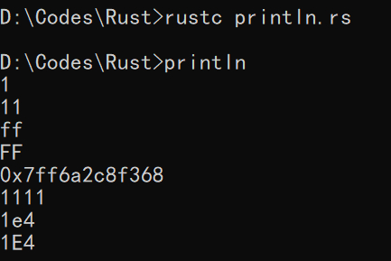

# Hello World
## 典型代码
新建一个文件，命名为 `hello_world.rs`。
一个 Rust 的 Hello World 通常是这样的：
```rust
fn main() {
    let s = "hello world!";
    println!("{}",s);
}
```
1. Rust源代码的后缀名为 `.rs`。注意源码必须使用 `utf-8` 编码。
2. `fn`是一个关键字，是 `function`的缩写 。Rust中函数定义必须以 `fn` 开头。
3. 一般情况下 ，`main`函数是程序的入口点，它是一个无参数、无返回值的函数。
4. 局部变量声明使用 `let` 关键字开头。
5. 标准输出使用 `println!` 宏来完成。这里有一个感叹号，代表它是一个宏而不是函数。注意：Rust中的宏与C/C++中的宏是完全不一样的东西。
   
## 编译与运行
对于这种简单创建的代码文件，可以使用 `rustc` 进行编译。
```
rustc hello_world.rs
```
这条命令会编译出可执行程序并存放到与代码文件相同的目录下。

## println! 宏的基本用法
```rust
fn main() {
    println!("{}",1);           // 默认用法
    println!("{:o}",9);         // 八进制
    println!("{:x}",255);       // 十六进制 小写
    println!("{:X}",255);       // 十六进制 大写
    println!("{:p}",&0);        // 指针
    println!("{:b}",15);        // 二进制
    println!("{:e}",10000f32);  // 科学计数 小写
    println!("{:E}",10000f32);  // 科学计数 大写
}
```
运行结果如图所示：


### 为什么这里使用宏而不是函数
Rust标准库提供这个宏做标准输出，主要是为了更好地完成编译期格式检查。若出现参数个数、格式等各种原因不匹配会导致编译错误。而函数则不具备这个功能，若出现不匹配的情况，会导致运行期出现错误。但实际上这个宏也是调用了标准库里的一些函数来实现的。